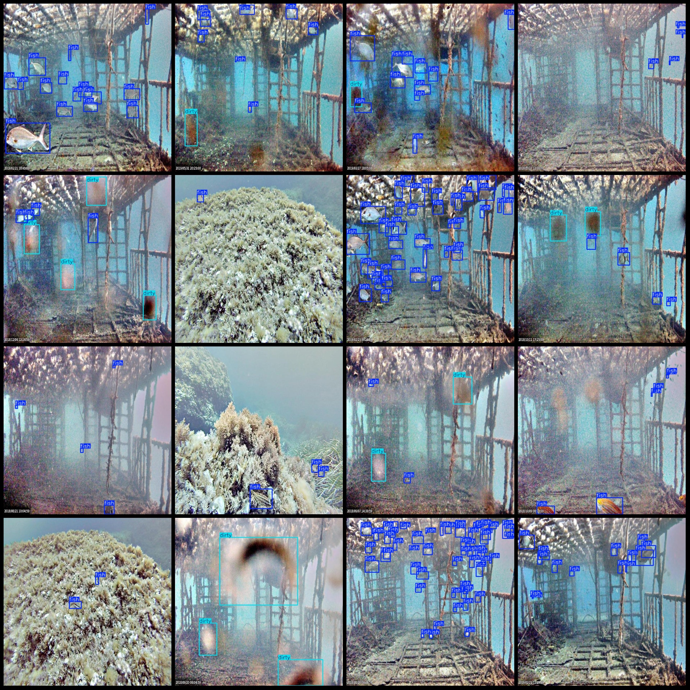
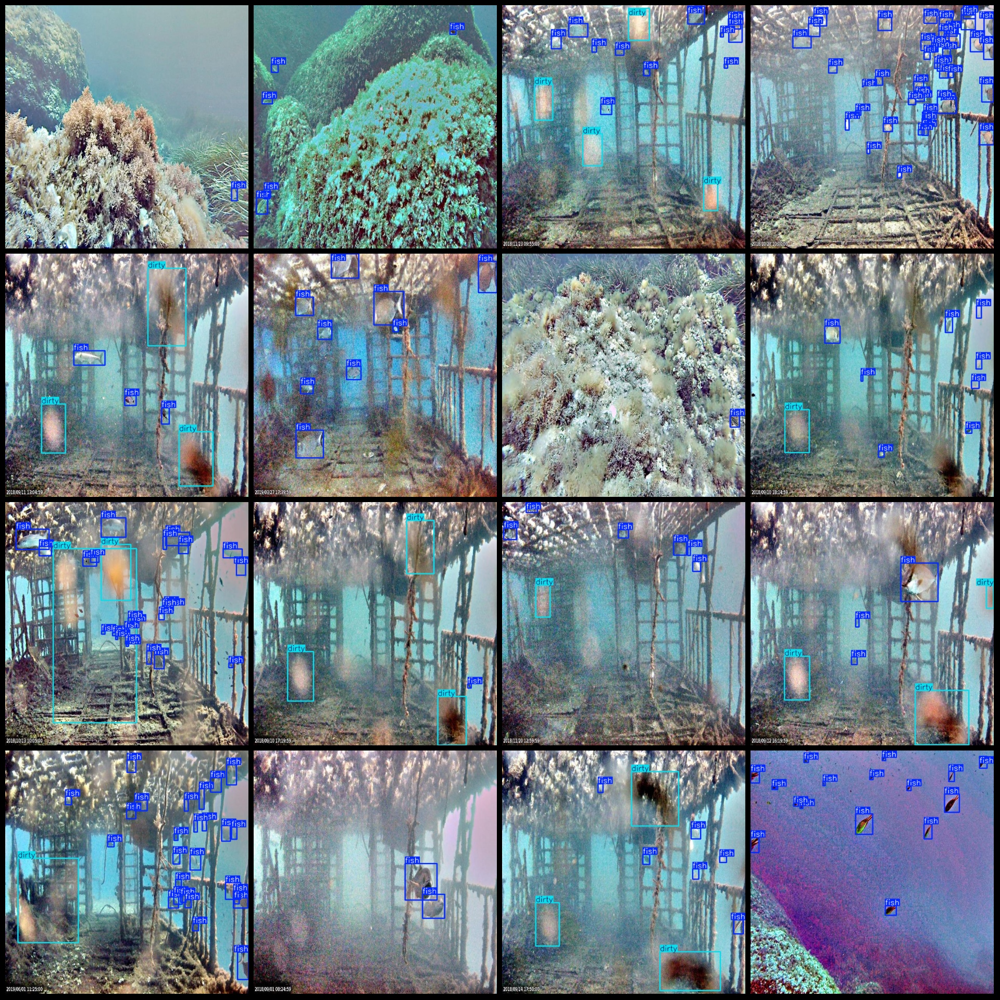

# Underwater Small Target Fish Detection Dataset VOC+YOLO in Pascal VOC format + YOLO format (excluding split path txt files, only containing jpg images and corresponding VOC format xml files and 
yolo format txt files)

Dataset format: Pascal VOC format + YOLO format (excluding split path txt files, only containing jpg images and corresponding VOC format xml files and yolo format txt files)
Image count (number of jpg files): 1190
Annotation count (number of xml files): 1190
Annotation count (number of txt files): 1190
Number of annotation categories: 2
Annotation category names (note that the order of labels in yolo format is not consistent with this, and should be based on the classes.txt file in the labels folder): ["dirty", "fish"]
Number of bounding box per category:
"dirty" number of bounding boxes = 724
"fish" number of bounding boxes = 12246
Total bounding boxes: 12970
Number of images per category:
"dirty" number of images = 263
"fish" number of images = 1182
Image resolution: 640x640
Annotation tool used: labelImg
Annotation rules: draw a box around the category
Important note: The dataset does not have any training validation test splits; you will need to divide it yourself.
Special declaration: This dataset does not guarantee the accuracy of the trained models or weight files.
Image preview:
Annotation example:

## Images

Here is a pay link on Stripe ( https://buy.stripe.com/3cs8yP7sY87d0vu9AB ). Please contact me lonlonago@foxmail.com after funding $89, and I will send you a complete data files , thank you!

